# Call Dependency Map

```mermaid
flowchart LR
  subgraph Browser["🌐 Browser / Client"]
    UI[Frontend Testing Page]
  end

  subgraph API["⚡ Express API Server"]
    direction LR
    Login["POST /public/user/session"]
    Logout["DELETE /user/session"]

    CompetitionList["GET /competition"]
    CompetitionGet["GET /competition/:id"]

    CodeCreate["POST /code"]
    CodeUpdate["PUT /code/:code_id"]
    CodeList["GET /code"]
    CodeGet["GET /code/:code_id"]

    EnrollList["GET /enroll"]
    EnrollGet["GET /enroll/:enroll_id"]

    LinkCodeGet["GET /enroll/:eid/code"]
    LinkCodePost["POST /enroll/:eid/code"]
    LinkCodeDelete["DELETE /enroll/:eid/code/:cid"]

    TestCreate["POST /enroll/:eid/test"]
    TestList["GET /enroll/:eid/test"]
    TestListAll["GET /test"]
    TestGet["GET /test/:id"]

    BattleCreate["POST /enroll/:eid/battle"]
    BattleList["GET /enroll/:eid/battle"]
    BattleListAll["GET /battle"]
    BattleGet["GET /battle/:id"]

    AdminUser["POST /admin/user"]
    AdminCompetition["POST /admin/competition"]
    AdminEnroll["POST /admin/enroll"]
    AdminWithdraw["DELETE /admin/enroll/:eid"]
    AdminApproveCode["POST /admin/approve-code"]
    AdminLogAttempt["POST /admin/battle-attempt/:id"]
    AdminCallback["PUT /admin/battle/:id"]
    AdminSnapshot["GET /admin/snapshot/:id"]
  end

  subgraph DB["🐘 PostgreSQL — app schema"]
    direction LR
    T_user[app.user]
    T_session[app.user_session]
    T_competition[app.competition]
    T_code[app.code]
    T_snapshot[app.snapshot]
    T_enroll[app.enroll]
    T_code_select[app.code_select]
    T_battle[app.battle]
    T_execution_log[app.execution_log]
  end

  subgraph SQS_["☁️ SQS"]
    Queue[Battle Queue]
    DLQ[Dead-Letter Queue]
  end

  subgraph Lambda_["☁️ Main Lambda (Python)"]
    direction LR
    Lambda_Handler[handler.py]
    Lambda_Sandbox[sandbox.py + _worker.py]
    S3_Download["⬇️ download game + helper"]
    S3_Upload["⬆️ upload replay video"]
  end

  subgraph DLQ_Consumer["☁️ DLQ Consumer Lambda"]
    DLQ_Handler[handler.py]
    DLQ_Callback["callback infra_ok=false"]
  end

  subgraph S3["☁️ S3 — python-pvp-store"]
    GameFile[game/game_ref/game.py]
    HelperFile[game/game_ref/helper.py]
    VideoFile[output/battle_id.mp4]
  end

  %% ── Browser → API ──────────────────────────────────────────────────────

  UI -- "HTTP POST username+password" --> Login
  UI -- "HTTP (Bearer session)" --> Logout
  UI -- "HTTP" --> CompetitionList
  UI -- "HTTP" --> CompetitionGet
  UI -- "HTTP" --> CodeCreate
  UI -- "HTTP" --> CodeUpdate
  UI -- "HTTP" --> CodeList
  UI -- "HTTP" --> CodeGet
  UI -- "HTTP" --> EnrollList
  UI -- "HTTP" --> EnrollGet
  UI -- "HTTP" --> LinkCodeGet
  UI -- "HTTP" --> LinkCodePost
  UI -- "HTTP" --> LinkCodeDelete
  UI -- "HTTP" --> TestCreate
  UI -- "HTTP" --> TestList
  UI -- "HTTP" --> TestListAll
  UI -- "HTTP" --> TestGet
  UI -- "HTTP" --> BattleCreate
  UI -- "HTTP" --> BattleList
  UI -- "HTTP" --> BattleListAll
  UI -- "HTTP" --> BattleGet

  %% ── Login → DB ─────────────────────────────────────────────────────────

  Login -. "SELECT hash_password, urole" .-> T_user
  Login -. "INSERT session" .-> T_session

  %% ── Logout → DB ────────────────────────────────────────────────────────

  Logout -. "UPDATE expire_at_utc" .-> T_session

  %% ── Competition endpoints → DB ─────────────────────────────────────────

  CompetitionList -. "SELECT" .-> T_competition
  CompetitionGet  -. "SELECT" .-> T_competition

  %% ── Code endpoints → DB ────────────────────────────────────────────────

  CodeCreate -. "INSERT code" .-> T_code
  CodeCreate -. "INSERT snapshot (if code provided)" .-> T_snapshot

  CodeUpdate -. "INSERT snapshot" .-> T_snapshot

  CodeList -. "SELECT c.*, s.code, EXISTS(battle tested)" .-> T_code
  CodeList -. "LEFT JOIN latest snapshot" .-> T_snapshot
  CodeList -. "EXISTS subquery (tested check)" .-> T_battle

  CodeGet -. "SELECT with JOIN" .-> T_code
  CodeGet -. "LEFT JOIN latest snapshot" .-> T_snapshot
  CodeGet -. "EXISTS subquery (tested check)" .-> T_battle

  %% ── Enroll endpoints → DB ──────────────────────────────────────────────

  EnrollList -. "SELECT" .-> T_enroll
  EnrollGet  -. "SELECT" .-> T_enroll

  %% ── Link code endpoints → DB ───────────────────────────────────────────

  LinkCodeGet -. "SELECT c.*, cs.*, s.code" .-> T_code
  LinkCodeGet -. "JOIN code_select, snapshot" .-> T_code_select
  LinkCodeGet -. "JOIN latest snapshot" .-> T_snapshot
  LinkCodeGet -. "EXISTS (tested check)" .-> T_battle

  LinkCodePost -. "SELECT code (ownership)" .-> T_code
  LinkCodePost -. "SELECT enroll (get comp_id)" .-> T_enroll
  LinkCodePost -. "DELETE old code_select" .-> T_code_select
  LinkCodePost -. "INSERT new code_select" .-> T_code_select

  LinkCodeDelete -. "DELETE" .-> T_code_select

  %% ── Test endpoints → DB + SQS ──────────────────────────────────────────

  TestCreate -. "SELECT e.competition_id, c.npc_user_id" .-> T_enroll
  TestCreate -. "JOIN competition" .-> T_competition
  TestCreate -. "SELECT s.id FROM snapshot JOIN code_select" .-> T_snapshot
  TestCreate -. "JOIN code_select" .-> T_code_select
  TestCreate -. "SELECT NPC enrollment" .-> T_enroll
  TestCreate -. "SELECT NPC tested snapshot" .-> T_snapshot
  TestCreate -. "JOIN code_select + EXISTS battle" .-> T_code_select
  TestCreate -. "EXISTS (tested)" .-> T_battle
  TestCreate -. "INSERT battle" .-> T_battle
  TestCreate -- "enqueueBattle()" --> Queue

  TestList -. "SELECT enroll (get comp_id)" .-> T_enroll
  TestList -. "SELECT battle (filtered)" .-> T_battle
  TestListAll -. "SELECT battle (filtered)" .-> T_battle
  TestGet -. "SELECT battle (filtered)" .-> T_battle

  %% ── Battle endpoints → DB + SQS ────────────────────────────────────────

  BattleCreate -. "SELECT enroll (comp_id)" .-> T_enroll
  BattleCreate -. "SELECT opponent enroll + code_select" .-> T_enroll
  BattleCreate -. "JOIN code_select" .-> T_code_select
  BattleCreate -. "SELECT my tested snapshot" .-> T_snapshot
  BattleCreate -. "JOIN code_select + EXISTS battle" .-> T_code_select
  BattleCreate -. "EXISTS (tested)" .-> T_battle
  BattleCreate -. "SELECT opp tested snapshot" .-> T_snapshot
  BattleCreate -. "EXISTS (tested)" .-> T_battle
  BattleCreate -. "INSERT battle" .-> T_battle
  BattleCreate -- "enqueueBattle()" --> Queue

  BattleList -. "SELECT enroll (comp_id)" .-> T_enroll
  BattleList -. "SELECT battle (filtered)" .-> T_battle
  BattleListAll -. "SELECT battle (filtered)" .-> T_battle
  BattleGet -. "SELECT battle (filtered)" .-> T_battle

  %% ── Admin endpoints → DB ───────────────────────────────────────────────

  AdminUser -. "SELECT (duplicate check)" .-> T_user
  AdminUser -. "INSERT user" .-> T_user

  AdminCompetition -. "INSERT competition" .-> T_competition

  AdminEnroll -. "INSERT (ON CONFLICT DO NOTHING)" .-> T_enroll

  AdminWithdraw -. "DELETE code_select" .-> T_code_select
  AdminWithdraw -. "DELETE enroll" .-> T_enroll

  AdminApproveCode -. "SELECT enroll + code_select" .-> T_enroll
  AdminApproveCode -. "JOIN code_select" .-> T_code_select
  AdminApproveCode -. "SELECT latest snapshot" .-> T_snapshot
  AdminApproveCode -. "SELECT (already tested?)" .-> T_battle
  AdminApproveCode -. "INSERT self-play battle" .-> T_battle

  AdminLogAttempt -. "INSERT execution_log" .-> T_execution_log

  AdminCallback -. "UPDATE (WHERE infra_ok IS NULL)" .-> T_battle
  AdminCallback -. "UPDATE tie_count (if draw)" .-> T_enroll
  AdminCallback -. "UPDATE win_count (if winner)" .-> T_enroll
  AdminCallback -. "UPDATE lose_count (if loser)" .-> T_enroll

  AdminSnapshot -. "SELECT" .-> T_snapshot

  %% ── SQS → Lambda ───────────────────────────────────────────────────────

  Queue -- "SQS event source mapping\n(batch size = 1)" --> Lambda_Handler
  Queue -- "after maxReceiveCount" --> DLQ

  %% ── Lambda → API ───────────────────────────────────────────────────────

  Lambda_Handler -- "POST /admin/battle-attempt/:id { lambda_request_id }" --> AdminLogAttempt
  Lambda_Handler -- "GET /admin/snapshot/:id" --> AdminSnapshot
  Lambda_Handler -- "GET /competition/:id (root bypass)" --> CompetitionGet
  Lambda_Handler -- "PUT /admin/battle/:id\n{ infra_ok, input_ok, ... }" --> AdminCallback

  %% ── DLQ Consumer → API ─────────────────────────────────────────────────

  DLQ -- "SQS event source mapping" --> DLQ_Consumer
  DLQ_Handler -- "PUT /admin/battle/:id\n{ infra_ok=false, input_ok=null }" --> AdminCallback

  %% ── Lambda → S3 ────────────────────────────────────────────────────────

  S3_Download -- "GetObject(game_reference)" --> GameFile
  S3_Download -- "GetObject(helper_reference)" --> HelperFile
  S3_Upload -- "PutObject(output/{id}.mp4)" --> VideoFile

  %% ── Browser → S3 (video streaming) ─────────────────────────────────────

  UI -- "GET (public bucket or CloudFront)\noutput/{battle_id}.mp4" --> VideoFile

  %% ── Styles ─────────────────────────────────────────────────────────────

  classDef api fill:#e1f5fe,stroke:#01579b,stroke-width:2px
  classDef db fill:#f3e5f5,stroke:#7b1fa2,stroke-width:2px
  classDef lambda fill:#fff3e0,stroke:#e65100,stroke-width:2px
  classDef dlq fill:#fce4ec,stroke:#c62828,stroke-width:2px
  classDef s3 fill:#e8f5e9,stroke:#2e7d32,stroke-width:2px
  classDef sqs fill:#fff8e1,stroke:#f9a825,stroke-width:2px
  classDef ext fill:#f5f5f5,stroke:#616161,stroke-width:1px

  class Login,Logout,CompetitionList,CompetitionGet,CodeCreate,CodeUpdate,CodeList,CodeGet,EnrollList,EnrollGet,LinkCodeGet,LinkCodePost,LinkCodeDelete,TestCreate,TestList,TestListAll,TestGet,BattleCreate,BattleList,BattleListAll,BattleGet,AdminUser,AdminCompetition,AdminEnroll,AdminWithdraw,AdminApproveCode,AdminLogAttempt,AdminCallback,AdminSnapshot api
  class T_user,T_session,T_competition,T_code,T_snapshot,T_enroll,T_code_select,T_battle,T_execution_log db
  class Lambda_Handler,Lambda_Sandbox,S3_Download,S3_Upload lambda
  class DLQ_Handler,DLQ_Callback dlq
  class GameFile,HelperFile,VideoFile s3
  class Queue,DLQ sqs
  class UI ext
```

## Legend

| Arrow style | Meaning |
|---|---|
| `─── HTTP ───>` | HTTP request (Browser → API, Lambda → API, Lambda → S3) |
| `- - . SQL . - ->` | SQL query to PostgreSQL |
| `─── enqueue ──>` | SQS send message (inside API transaction) |
| `─── event ───>` | SQS event source mapping (triggers Lambda) |

## Key design details

### Null-pattern for battle status
`app.battle.infra_ok` and `input_ok` both `null` = pending. Both set = completed/failed.  
The callback uses `WHERE infra_ok IS NULL` so late DLQ retries never overwrite a successful result.

### At-most-one code per enrollment
`POST /enroll/:eid/code` — `DELETE` old `code_select` then `INSERT` new one, inside a single transaction.

### Snapshot transparency
Users only see `POST /code {name, code}` and `PUT /code/:id {code}`. Snapshots are created internally. The `tested` field on code responses = "latest snapshot has a completed battle."

### Test vs Battle distinction
- **Test** (`is_test=true`): user vs NPC. Auto-selects NPC enrollment via `competition.npc_user_id`. Uses user's latest snapshot (any) + NPC's latest **tested** snapshot.
- **Battle** (`is_test=false`): user vs another enrolled user. Both sides must have a **tested** snapshot.

### Lambda success-only recording
Main Lambda only records success. On any failure (infra or user code), it raises → SQS retries → after maxReceiveCount → DLQ → DLQ consumer writes `infra_ok=false, input_ok=null`.
